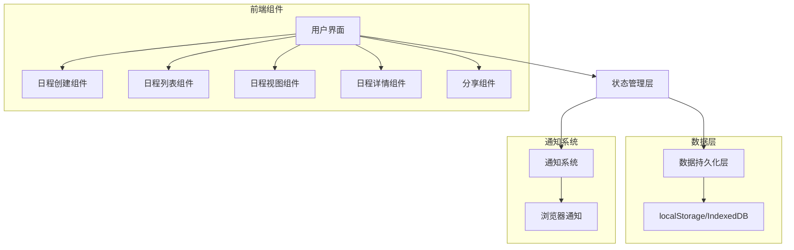

# Schedule Builder 设计文档

## 概述

Schedule Builder 是一个基于 Web 的日程安排工具，允许用户创建、管理、查看和分享他们的日程安排。该功能将替代现有的 Random Letter 功能，提供更实用的时间管理工具。设计将遵循现有网站的 UI/UX 风格，同时引入新的交互模式来支持日程管理功能。

## 架构

Schedule Builder 将采用以下架构：

1. **前端**：使用 React 和 Next.js 框架，与现有网站保持一致
2. **状态管理**：使用 React 的 Context API 和 Hooks 进行本地状态管理
3. **持久化存储**：使用浏览器的 localStorage/IndexedDB 存储用户日程数据
4. **UI 组件**：使用 Tailwind CSS 进行样式设计，保持与现有网站风格一致
5. **通知系统**：使用浏览器的 Notification API 实现提醒功能

### 架构图



## 组件和接口

### 页面组件

1. **ScheduleBuilderPage**：主页面组件，包含所有子组件和状态管理
   - 路径：`src/pages/ScheduleBuilderPage.tsx`
   - 功能：整合所有子组件，管理全局状态

2. **ResponsiveHero**：顶部英雄区域组件
   - 路径：`src/components/schedule-builder/client/ResponsiveHero.tsx`
   - 功能：显示页面标题和简短描述

### 功能组件

1. **ScheduleCreator**：日程创建组件
   - 路径：`src/components/schedule-builder/client/ScheduleCreator.tsx`
   - 功能：提供创建和编辑日程的表单界面
   - 接口：
     ```typescript
     interface ScheduleCreatorProps {
       initialData?: Schedule;
       onSave: (schedule: Schedule) => void;
       onCancel: () => void;
     }
     ```

2. **ScheduleList**：日程列表组件
   - 路径：`src/components/schedule-builder/client/ScheduleList.tsx`
   - 功能：显示用户所有日程的列表视图
   - 接口：
     ```typescript
     interface ScheduleListProps {
       schedules: Schedule[];
       onEdit: (id: string) => void;
       onDelete: (id: string) => void;
       onView: (id: string) => void;
     }
     ```

3. **ScheduleCalendar**：日历视图组件
   - 路径：`src/components/schedule-builder/client/ScheduleCalendar.tsx`
   - 功能：提供日、周、月视图的日历界面
   - 接口：
     ```typescript
     interface ScheduleCalendarProps {
       schedules: Schedule[];
       view: 'day' | 'week' | 'month';
       date: Date;
       onDateChange: (date: Date) => void;
       onViewChange: (view: 'day' | 'week' | 'month') => void;
       onScheduleClick: (id: string) => void;
     }
     ```

4. **ScheduleDetail**：日程详情组件
   - 路径：`src/components/schedule-builder/client/ScheduleDetail.tsx`
   - 功能：显示单个日程的详细信息
   - 接口：
     ```typescript
     interface ScheduleDetailProps {
       schedule: Schedule;
       onEdit: () => void;
       onDelete: () => void;
       onShare: () => void;
       onBack: () => void;
     }
     ```

5. **ScheduleShare**：日程分享组件
   - 路径：`src/components/schedule-builder/client/ScheduleShare.tsx`
   - 功能：生成和管理分享链接
   - 接口：
     ```typescript
     interface ScheduleShareProps {
       schedule: Schedule;
       onClose: () => void;
     }
     ```

6. **NotificationManager**：通知管理组件
   - 路径：`src/components/schedule-builder/client/NotificationManager.tsx`
   - 功能：管理和触发浏览器通知
   - 接口：
     ```typescript
     interface NotificationManagerProps {
       schedules: Schedule[];
     }
     ```

### 上下文和钩子

1. **ScheduleContext**：日程数据上下文
   - 路径：`src/components/schedule-builder/context/ScheduleContext.tsx`
   - 功能：提供全局状态管理和数据访问

2. **useSchedule**：日程管理钩子
   - 路径：`src/components/schedule-builder/hooks/useSchedule.tsx`
   - 功能：提供日程数据的 CRUD 操作

3. **useNotification**：通知管理钩子
   - 路径：`src/components/schedule-builder/hooks/useNotification.tsx`
   - 功能：管理通知权限和触发通知

## 数据模型

### Schedule（日程）

```typescript
interface Schedule {
  id: string;           // 唯一标识符
  title: string;        // 日程标题
  description: string;  // 日程描述
  startTime: Date;      // 开始时间
  endTime: Date;        // 结束时间
  reminders: Reminder[]; // 提醒设置
  color?: string;       // 可选的颜色标记
  shared: boolean;      // 是否已分享
  shareSettings?: ShareSettings; // 分享设置
}

interface Reminder {
  id: string;           // 唯一标识符
  time: Date;           // 提醒时间
  triggered: boolean;   // 是否已触发
}

interface ShareSettings {
  shareId: string;      // 分享链接ID
  permission: 'read' | 'edit'; // 权限级别
  expiresAt?: Date;     // 过期时间（可选）
}
```

## 错误处理

1. **数据验证错误**：
   - 在表单提交前进行客户端验证
   - 显示具体的错误信息，如"结束时间必须晚于开始时间"

2. **存储错误**：
   - 检测 localStorage/IndexedDB 存储失败
   - 提供备用存储选项或清理旧数据

3. **通知权限错误**：
   - 处理用户拒绝通知权限的情况
   - 提供替代的提醒方式（如页面内提醒）

4. **时间冲突处理**：
   - 检测并警告用户日程时间冲突
   - 提供解决冲突的建议

## 测试策略

### 单元测试

1. **组件测试**：
   - 测试每个组件的渲染和基本功能
   - 使用 React Testing Library 和 Jest

2. **钩子测试**：
   - 测试自定义钩子的功能和边界条件
   - 模拟上下文和浏览器 API

### 集成测试

1. **功能流程测试**：
   - 测试完整的日程创建、编辑、删除流程
   - 测试日程视图切换和导航

2. **数据持久化测试**：
   - 测试数据保存和加载功能
   - 测试浏览器刷新后的数据恢复

### 用户界面测试

1. **响应式设计测试**：
   - 测试不同屏幕尺寸下的布局
   - 确保移动设备上的良好体验

2. **可访问性测试**：
   - 测试键盘导航和屏幕阅读器兼容性
   - 确保符合 WCAG 标准

## 实现注意事项

1. **性能优化**：
   - 使用 React.memo 和 useMemo 优化渲染性能
   - 分页加载大量日程数据

2. **本地存储限制**：
   - 监控 localStorage/IndexedDB 使用量
   - 实现数据清理策略

3. **浏览器兼容性**：
   - 确保主流浏览器支持
   - 为不支持的 API 提供 polyfill 或降级方案

4. **离线功能**：
   - 考虑实现基本的离线功能
   - 在网络恢复时同步数据

5. **数据导出/导入**：
   - 提供日程数据的导出功能（如 iCal 格式）
   - 支持从其他日历应用导入数据